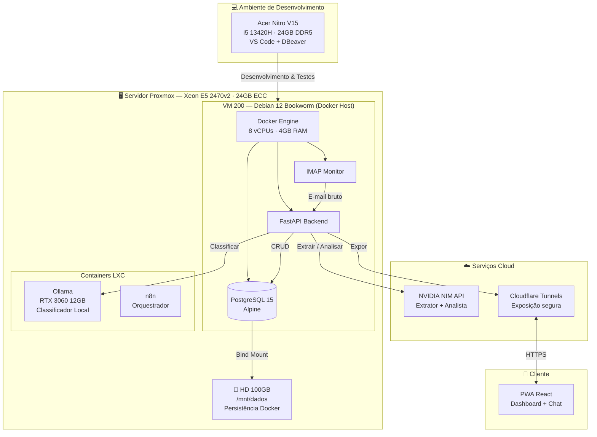
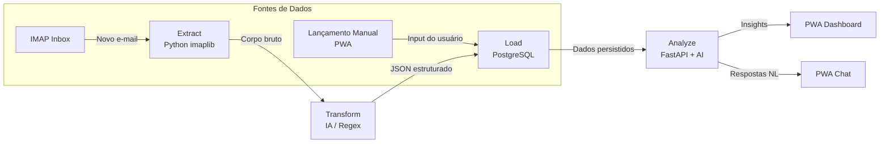

<div align="center">

# 🧠💰 FinAI

**Inteligência Financeira Baseada em Eventos de E-mail**

[](https://www.python.org/)
[](https://www.postgresql.org/)
[](https://www.docker.com/)
[](https://fastapi.tiangolo.com/)
[](https://react.dev/)
[](https://build.nvidia.ai/)
[](https://ollama.com/)

*Ecossistema de gestão financeira pessoal que elimina o preenchimento manual de gastos. Captura transações bancárias via e-mail (IMAP), processa com IA Híbrida e exibe em um WebApp PWA.*

</div>

---

## 📑 Sumário

- [Sobre o Projeto](#-sobre-o-projeto)
- [Funcionalidades](#-funcionalidades)
- [Arquitetura e Hospedagem](#-arquitetura-e-hospedagem)
- [IA Híbrida](#-ia-híbrida)
- [Stack Tecnológica](#-stack-tecnológica)
- [Data Pipeline](#-data-pipeline)
- [Como Rodar](#-como-rodar)
- [Estrutura do Projeto](#-estrutura-do-projeto)
- [Roadmap](#-roadmap-the-roadcode)
- [Segurança](#-segurança)
- [Licença](#-licença)

---

## 🎯 Sobre o Projeto

O FinAI automatiza a coleta de dados financeiros (**Pix, Crédito e Débito**) a partir de mensagens de e-mail dos bancos **Nubank, Inter, Mercado Pago e PicPay**, centralizando-os em um WebApp PWA que permite análise preditiva e interação via linguagem natural.

O sistema **não armazena credenciais bancárias** — apenas conecta ao e-mail via IMAP com Senhas de Aplicativo (App Passwords), processa o conteúdo com IA e persiste os dados em PostgreSQL.

---

## ✨ Funcionalidades

| Categoria | Funcionalidade |
|-----------|---------------|
| **Ingestão** | Monitoramento contínuo via IMAP com whitelist de domínios bancários |
| **Parsing** | Extração de valor, data, estabelecimento e tipo de transação por banco |
| **Classificação** | Categorização automática de gastos (Alimentação, Transporte, Lazer, etc.) |
| **Consolidação** | Soma de entradas (Pix recebido) e saídas (cartão/Pix enviado) |
| **Dashboard** | Visualização em tempo real de gastos vs. limite disponível |
| **Chat Financeiro** | Consultas em linguagem natural sobre os dados armazenados |
| **PWA** | WebApp instalável no celular com experiência nativa (standalone) |
| **Lançamento Manual** | Botão "Lançamento Rápido" para inserir gastos não capturados por e-mail |
| **Parcelamentos** | Registro de compras parceladas com projeção de faturas futuras via IA |

---

## 🏗️ Arquitetura e Hospedagem

O FinAI opera em dois ambientes físicos distintos, separados entre desenvolvimento e produção:



### Ambientes

| Aspecto | Desenvolvimento | Produção (Docker Host) |
|---------|----------------|----------------------|
| **Máquina** | Acer Nitro V15 (i5 13420H, 24GB DDR5) | VM 200 no Proxmox (Xeon E5 2470v2, 24GB ECC) |
| **Sistema** | Windows 11 | Debian 12 Bookworm (sem GUI) |
| **Função** | Codificação (VS Code), testes locais, acesso ao banco via DBeaver | Execução dos contêineres Docker do FinAI |
| **Recursos da VM** | — | 8 vCPUs, 4GB RAM |
| **IP da VM** | — | `192.168.1.9` |
| **Gerenciamento** | — | Portainer na porta 9443 |

### Armazenamento e Persistência

O disco de sistema da VM (NVMe 32GB) é reservado para o SO. Toda a persistência do Docker utiliza um **disco secundário HDD de 100GB** montado em `/mnt/dados`, garantindo que:

- Os dados sobrevivam à recriação de contêineres
- O disco de sistema não seja consumido por volumes do Docker
- O bind mount do PostgreSQL aponte para `/mnt/dados/finai/postgres_data_v2`

### Exposição para a Internet

O sistema **não abre portas no roteador**. A comunicação externa (WebApp PWA) é feita de forma segura utilizando **Cloudflare Tunnels**, que cria um túnel criptografado entre a VM e a rede Cloudflare, expondo apenas os serviços necessários.

---

## 📬 Estratégia de Captura de Dados por Banco

A precisão da ingestão de transações depende do comportamento de notificação de cada instituição financeira. Mapeamos os seguintes padrões:

| Banco | Precisão da Captura | Comportamento |
|-------|-------------------|--------------|
| **Inter** | 🟢 Alta | Envia e-mails detalhados (valor, data, estabelecimento) para quase todas as operações |
| **Mercado Pago** | 🟢 Alta | Envia e-mails detalhados (valor, data, estabelecimento) para quase todas as operações |
| **Nubank** | 🟡 Parcial | Foco em notificações Push no celular. E-mail garantido para transações Pix, mas pode falhar em compras pequenas no crédito |
| **PicPay** | 🟡 Parcial | Foco em notificações Push no celular. E-mail garantido para transações Pix, mas pode falhar em compras pequenas no crédito |

### Solução de Contorno

Para compensar as limitações do Nubank e PicPay, duas estratégias complementares foram adotadas:

1. **Parser da Fatura Fechada:** O extrator será configurado para realizar o parsing do e-mail de "Fatura Fechada" (resumo mensal), capturando todas as transações do período de uma só vez.

2. **Lançamento Rápido:** O WebApp PWA contará com um botão de "Lançamento Rápido" para inserção manual de gastos não notificados, garantindo que nenhuma transação fique de fora.

---

## 💳 Gestão de Parcelamentos e Entradas Manuais

E-mails de confirmação de compra parcelada ocorrem apenas no momento da transação e **não se repetem mensalmente**. Para lidar com isso, adotamos uma solução híbrida:

### Solução Híbrida

| Componente | Descrição |
|-----------|-----------|
| **Registro Manual** | O usuário registrará compras parceladas manualmente no PWA (ex: "Monitor, R$ 1.000 em 10x") |
| **Projeção por IA** | O modelo "O Analista" (NVIDIA NIM) utilizará esses dados para projetar faturas futuras, respondendo a prompts como *"Quanto terei de fatura em agosto?"* |

### Nova Tabela: `parcelamentos`

Para suportar esta funcionalidade, foi adicionada a tabela `parcelamentos` na modelagem do PostgreSQL:

| Campo | Tipo | Descrição |
|-------|------|-----------|
| `id` | UUID | Identificador único |
| `descricao` | VARCHAR | Descrição da compra (ex: "Monitor 27 polegadas") |
| `valor_parcela` | FLOAT | Valor de cada parcela individual |
| `total_parcelas` | INT | Número total de parcelas |
| `parcela_atual` | INT | Parcela atual (incrementada mensalmente) |
| `data_inicio` | DATE | Data da primeira parcela |
| `card_id` | UUID | Chave estrangeira para a tabela `card` |
| `created_at` | TIMESTAMP | Data de inserção no sistema |

---

## 🧠 IA Híbrida

O FinAI utiliza uma abordagem híbrida para otimizar **latência, custo e precisão**, dividindo o processamento entre a nuvem (NVIDIA NIM) e o local (Ollama com GPU RTX 3060 12GB):

```mermaid
flowchart TB
    subgraph Cloud_NIM["☁️ NVIDIA NIM — Cloud"]
        E1["O Extrator<br/>Modelo leve (a definir)<br/>Extração de dados do e-mail"]
        E2["O Analista<br/>Modelo pesado (a definir)<br/>Chat e projeções financeiras"]
    end

    subgraph Local_Ollama["🏠 Ollama — Local · RTX 3060"]
        L1["O Classificador<br/>Modelo local (a definir)<br/>Categorização de estabelecimentos"]
    end

    RawEmail["E-mail Bruto"] --> E1
    E1 -->|"JSON estruturado"| DB[("PostgreSQL")]
    DB --> L1
    L1 -->|"Categoria"| DB
    DB --> E2
    UserQuery["Consulta do Usuário"] --> E2
    E2 -->|"Resposta com dados"| ChatUI["Chat Interface"]
```



### Estratégia de Modelos

| Papel | Infraestrutura | Função | Justificativa |
|-------|---------------|--------|---------------|
| **O Extrator** | NVIDIA NIM (Cloud) | Recebe o texto bruto do e-mail e gera JSON estruturado | Rapidez e baixo consumo de tokens para tarefas repetitivas |
| **O Analista** | NVIDIA NIM (Cloud) | Chat do app, cálculos complexos e projeções financeiras | Alto poder de raciocínio para perguntas complexas |
| **O Classificador** | Ollama (Local) | Categorização de estabelecimentos e rotulagem simples | Redução de chamadas de API externas e maior privacidade |

> **Nota:** Os modelos específicos para cada papel serão definidos durante as fases de implementação da IA (Fase 5).

---

## 🛠️ Stack Tecnológica

| Camada | Tecnologia |
|--------|------------|
| **Backend** | Python 3.12+ / FastAPI |
| **Frontend** | React (Vite) / Tailwind CSS |
| **Banco de Dados** | PostgreSQL 15 (Alpine) |
| **Automação** | n8n / Python Scripts |
| **Infraestrutura** | Docker / Proxmox VE / Cloudflare Tunnels |
| **AI — Extração** | NVIDIA NIM (modelo a definir) |
| **AI — Análise** | NVIDIA NIM (modelo a definir) |
| **AI — Classificação** | Ollama local (modelo a definir) |

---

## 📊 Data Pipeline

O fluxo do dado segue o modelo **ETL (Extract, Transform, Load)** com uma camada adicional de **Analyze**. O sistema aceita duas fontes de dados distintas:



### Fontes de Dados

| Fonte | Gatilho | Processamento |
|-------|---------|--------------|
| **IMAP (E-mail)** | Novo e-mail na caixa de entrada | Extract → Transform → Load |
| **Lançamento Manual (PWA)** | Usuário preenche formulário no app | Load direto (dados já estruturados) |

### Etapas do Pipeline

| Etapa | Descrição | Tecnologia |
|-------|-----------|------------|
| **Extract** | Script Python monitora a Inbox e captura o corpo do e-mail | Python + `imaplib` |
| **Transform** | IA/Regex extrai os dados brutos e normaliza para o padrão do sistema | NVIDIA NIM / Ollama |
| **Load** | Persistência no banco de dados PostgreSQL com deduplicação | PostgreSQL + SQLAlchemy |
| **Analyze** | O Backend serve os dados para o Frontend e para a camada de raciocínio da IA | FastAPI + RAG |

---

## 🚀 Como Rodar

### Pré-requisitos

- [Docker](https://docs.docker.com/get-docker/) e Docker Compose instalados
- Python 3.12+ (para o extrator local)
- Acesso à VM Docker Host (ou ambiente local equivalente)
- Senha de Aplicativo do Gmail ([como gerar](https://support.google.com/accounts/answer/185833))

### 1. Configurar as variáveis de ambiente

```bash
# Navegue até o diretório do backend
cd finai-backend/

# Copie o template e preencha com seus valores
cp .env.example .env
```

Edite o arquivo `.env` com suas credenciais:

```env
POSTGRES_USER=seu_usuario
POSTGRES_PASSWORD=sua_senha_segura
POSTGRES_DB=finai

EMAIL_ACCOUNT=seu_email@gmail.com
EMAIL_APP_PASSWORD=sua_senha_de_aplicativo
```

> ⚠️ **NUNCA** commit o arquivo `.env` — ele está protegido pelo `.gitignore`.

### 2. Subir o PostgreSQL

```bash
# Via Docker Compose
docker compose up -d

# Ou via Portainer: importe o docker-compose.yml como Stack
```

O banco estará disponível na porta `5432`. Para validar a conexão externa, use um cliente como [DBeaver](https://dbeaver.io/) apontando para o IP da VM.

### 3. Rodar o Extrator IMAP

```bash
# Crie e ative o ambiente virtual
python -m venv venv
source venv/bin/activate  # Linux/macOS
# venv\Scripts\activate   # Windows

# Instale as dependências
pip install python-dotenv

# Execute o extrator
python extractor.py
```

Se tudo estiver correto, você verá:

```
Iniciando conexao com o servidor IMAP . . .
Login realizado com sucesso no e-mail: seu_email@gmail.com
Você tem X e-mails na sua Caixa de entrada.
Conexão encerrada com segurança.
```

---

## 📁 Estrutura do Projeto

```
FinAI/
├── README.md                    # Documentação principal (este arquivo)
├── .gitignore                   # Regras de versionamento
├── docs/
│   └── arquitetura.md           # Documentação de arquitetura detalhada
├── Documentos/                  # Documentos de referência (não versionados)
│   ├── FinAI.md                 # Especificação funcional do projeto
│   ├── docker-vm.txt            # Notas sobre a VM Docker
│   └── PROXMOX_VVY.md           # Documentação do servidor Proxmox
└── finai-backend/
    ├── .env.example             # Template de variáveis de ambiente
    ├── .gitignore               # Regras de versionamento do backend
    ├── docker-compose.yml       # Stack do PostgreSQL
    ├── extractor.py             # Extrator IMAP (Fase 1)
    └── venv/                    # Ambiente virtual Python (ignorado)
```

---

## 🗺️ Roadmap (The Roadcode)

### Fase 1: O Extrator — MVP ✅ *Em andamento*
- [x] Conexão IMAP com SSL (porta 993)
- [x] Autenticação via Senha de Aplicativo
- [x] Validação de acesso à INBOX
- [ ] Keep-alive e reconexão automática
- [ ] Filtros de segurança (whitelist de domínios bancários)
- [ ] Parsers iniciais para **Nubank** e **Inter**
- [ ] Parser de **Fatura Fechada** (resumo mensal) para Nubank e PicPay
- [ ] Extração de dados: valor, data, estabelecimento, tipo de transação
- [ ] Testes unitários com e-mails reais anonimizados

### Fase 2: O Alicerce de Dados
- [ ] Modelagem do banco de dados (Tabelas de Transações, Cartões, Configurações e Parcelamentos)
- [ ] Tabela `parcelamentos`: id, descricao, valor_parcela, total_parcelas, parcela_atual, data_inicio, card_id, created_at
- [ ] Implementação da lógica de deduplicação (hash SHA-256 do Message-ID)
- [ ] Migrations com Alembic
- [ ] Índices e constraints para performance

### Fase 3: A API e Backend
- [ ] Desenvolvimento de endpoints REST para servir o dashboard
- [ ] Integração com o sistema de autenticação (JWT/OAuth2)
- [ ] Endpoints de configuração (limites, datas de fechamento, vencimento)
- [ ] Endpoints CRUD para **parcelamentos** e **lançamento rápido**
- [ ] Webhook para notificações em tempo real (WebSocket)

### Fase 4: O WebApp PWA
- [ ] Desenvolvimento da interface mobile-first com React + Tailwind
- [ ] Dashboard com gráficos de gastos vs. limite
- [ ] Componente de **Lançamento Rápido** para inserção manual de gastos
- [ ] Interface de registro e visualização de **parcelamentos**
- [ ] Configuração do Service Worker e Manifest para instalação mobile
- [ ] Interface de chat financeiro integrada

### Fase 5: Inteligência e Análise
- [ ] Implementação da camada RAG (Retrieval-Augmented Generation)
- [ ] Integração do O Classificador local (Ollama)
- [ ] Integração do O Analista (NVIDIA NIM)
- [ ] Pipeline de categorização automática de estabelecimentos
- [ ] Projeção de faturas futuras com base nos **parcelamentos** registrados
- [ ] Análise preditiva de gastos e projeções de limite

---

## 🔒 Segurança

| Aspecto | Medida |
|---------|--------|
| **Credenciais** | Nenhuma credencial no código — arquivo `.env` protegido pelo `.gitignore` |
| **E-mail** | Senha de Aplicativo (App Password), nunca a senha principal da conta |
| **Whitelist** | Apenas domínios autenticados dos bancos são processados |
| **Deduplicação** | Hash SHA-256 do Message-ID para evitar registros duplicados |
| **Dados Sensíveis** | Nenhum dado de cartão ou senha é armazenado |
| **Comunicação** | Cloudflare Tunnels para exposição segura dos serviços |
| **Autenticação** | JWT com refresh tokens para acesso à API (Fase 3) |
| **12-Factor App** | Configuração via variáveis de ambiente, não hardcoded |

### Domínios Autorizados (Whitelist)

| Banco | Domínio Esperado |
|-------|-----------------|
| Nubank | `@nubank.com.br` |
| Inter | `@bancointer.com.br` |
| Mercado Pago | `@mercadopago.com` / `@mercadolivre.com` |
| PicPay | `@picpay.com` |

---

## 📄 Licença

Projeto privado. Todos os direitos reservados.
