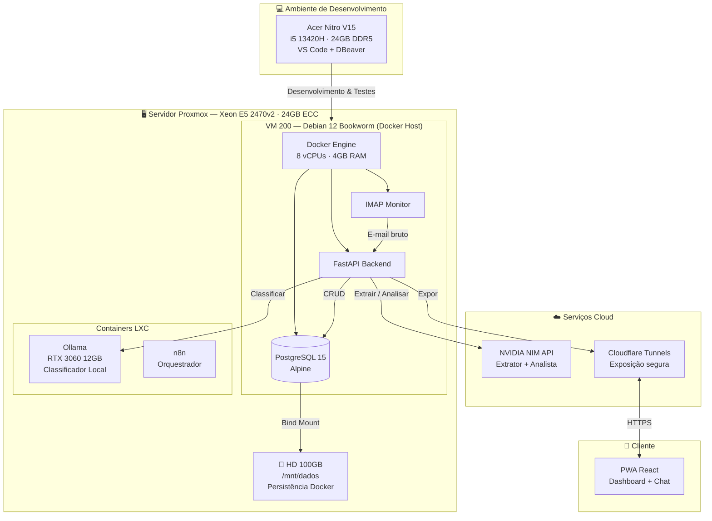
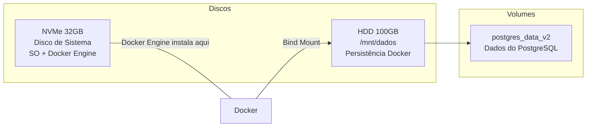
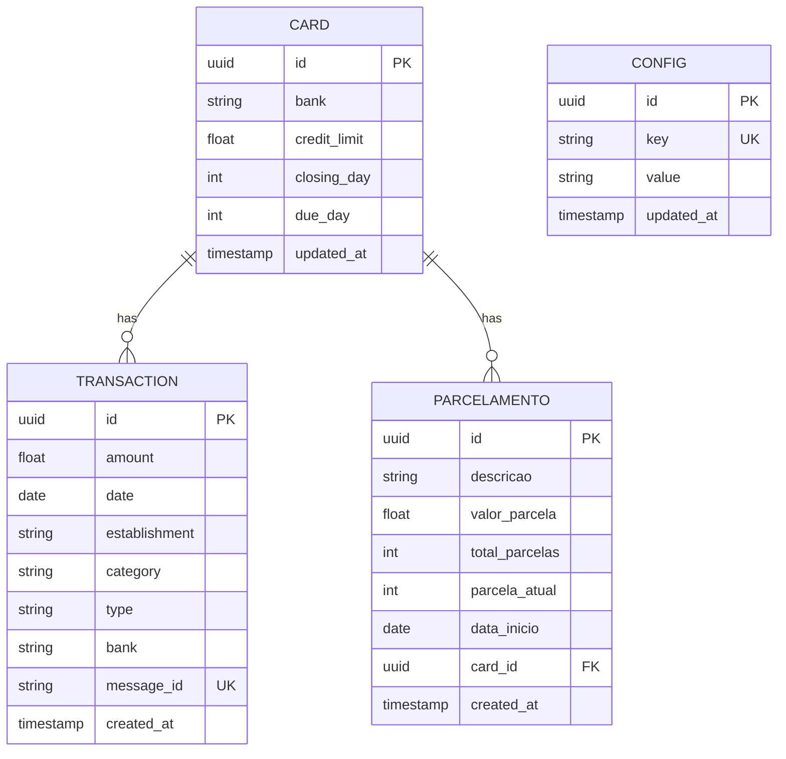
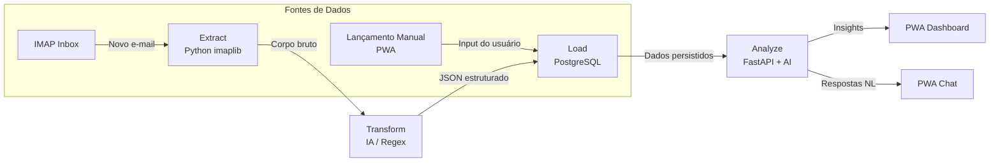
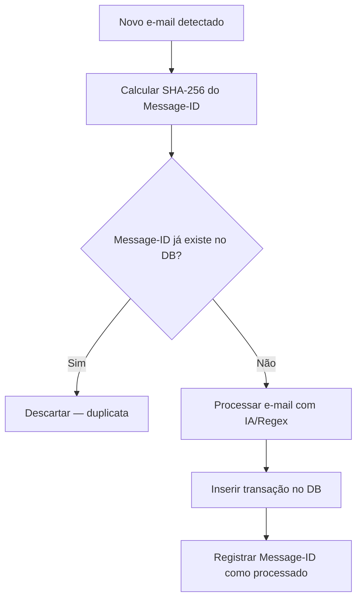
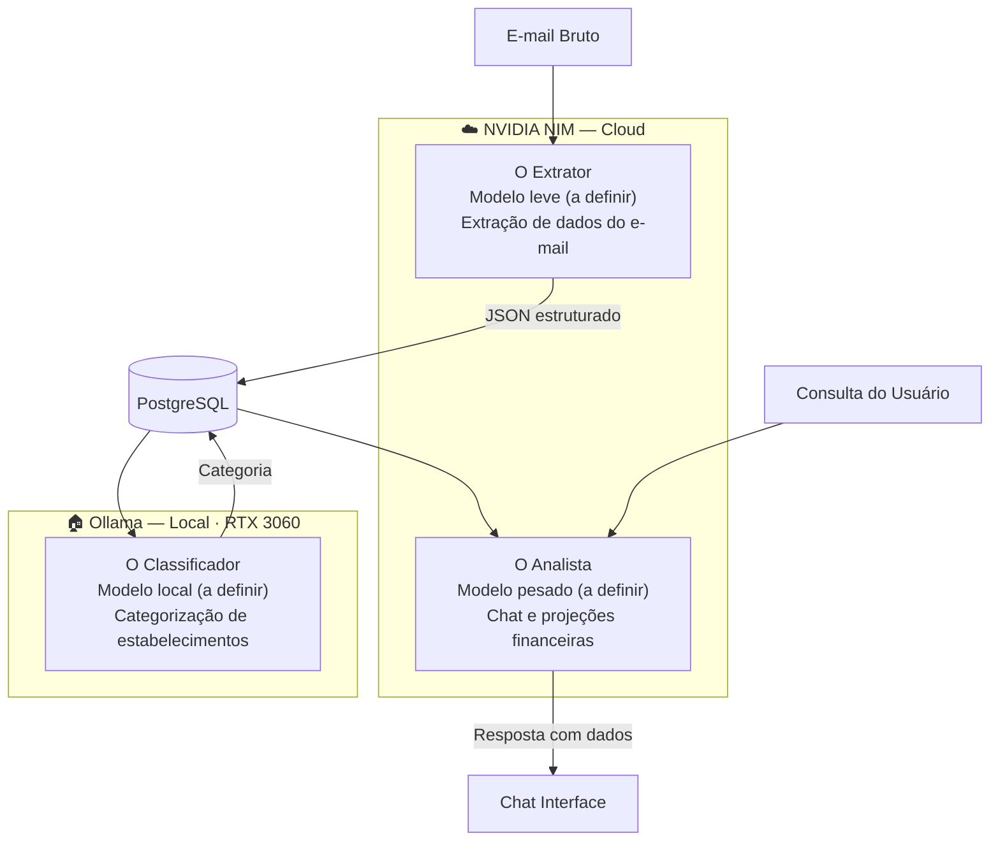

# 🏗️ Arquitetura do FinAI

> Documentação detalhada da arquitetura física, virtual e de software do projeto FinAI.

---

## 📑 Sumário

- [Topologia de Infraestrutura](#topologia-de-infraestrutura)
- [Host de Desenvolvimento](#host-de-desenvolvimento)
- [Host de Produção (Proxmox)](#host-de-produção-proxmox)
- [VM Docker Host](#vm-docker-host)
- [Armazenamento e Persistência](#armazenamento-e-persistência)
- [Arquitetura de Dados](#arquitetura-de-dados)
- [Precisão da Captura por Banco](#-precisão-da-captura-por-banco)
- [Gestão de Parcelamentos](#-gestão-de-parcelamentos)
- [Data Pipeline](#data-pipeline)
- [Camada de IA Híbrida](#camada-de-ia-híbrida)
- [Segurança](#segurança)
- [Padrões de E-mail por Banco](#padrões-de-e-mail-por-banco)

---

## Topologia de Infraestrutura



---

## Host de Desenvolvimento

| Componente | Especificação |
|-----------|--------------|
| **Máquina** | Acer Nitro V15 |
| **CPU** | Intel Core i5 13420H |
| **RAM** | 24 GB DDR5 5200 MHz |
| **Uso** | Codificação (VS Code), testes locais, acesso ao banco via DBeaver |
| **Sistema** | Windows 11 |

O host de desenvolvimento é utilizado exclusivamente para **escrita de código, depuração e validação local**. Nenhum serviço do FinAI roda em produção nesta máquina.

---

## Host de Produção (Proxmox)

| Componente | Especificação |
|-----------|--------------|
| **Hypervisor** | Proxmox VE |
| **CPU** | Intel Xeon E5 2470v2 (10 núcleos, 20 threads) |
| **RAM** | 24 GB DDR3 ECC |
| **GPU** | NVIDIA RTX 3060 12GB (passthrough para LXC Ollama) |
| **Função** | Núcleo de processamento 24/7 para todos os serviços do FinAI |

O servidor Proxmox atua como núcleo de processamento para tarefas que exigem disponibilidade contínua, permitindo que o notebook de desenvolvimento seja utilizado apenas para interface de trabalho e criação.

### Containers LXC Relevantes ao FinAI

| ID | Nome | IP | Recursos | Função no FinAI |
|----|------|-----|---------|-----------------|
| 102 | ollama | 192.168.1.102 | 8 cores, 8GB RAM, GPU RTX 3060 | **O Classificador** — inferência local de IA |
| 103 | n8n | 192.168.1.103 | 4 cores, 20GB storage | Orquestração de workflows de automação |

> **Nota:** O LXC 102 (Ollama) possui GPU passthrough da RTX 3060, necessária para inferência local com desempenho adequado. O container é privilegiado para permitir acesso direto aos dispositivos NVIDIA.

---

## VM Docker Host

| Parâmetro | Valor |
|-----------|-------|
| **ID da VM** | 200 |
| **Nome** | debian |
| **Sistema Operacional** | Debian 12.12 (Bookworm), sem interface gráfica |
| **vCPUs** | 8 |
| **RAM** | 4 GB |
| **Disco de Sistema** | 32 GB (NVMe) |
| **Disco de Dados** | 100 GB (HDD, montado em `/mnt/dados`) |
| **IP** | 192.168.1.9 (DHCP reservado via roteador) |
| **Acesso SSH** | `debian@192.168.1.9` |
| **Docker** | Versão estável (repositório oficial) |
| **Portainer** | `https://192.168.1.9:9443` |
| **Data de Criação** | Abril/2026 |

### Serviços Docker do FinAI

| Serviço | Imagem | Porta | Persistência |
|---------|--------|-------|-------------|
| PostgreSQL | `postgres:15-alpine` | 5432 | Bind mount em `/mnt/dados/finai/postgres_data_v2` |

### docker-compose.yml

```yaml
version: '3.8'

services:
  db:
    image: postgres:15-alpine
    container_name: finai_postgres
    restart: always
    environment:
      POSTGRES_USER: ${POSTGRES_USER}
      POSTGRES_PASSWORD: ${POSTGRES_PASSWORD}
      POSTGRES_DB: ${POSTGRES_DB}
    ports:
      - "5432:5432"
    volumes:
      - /mnt/dados/finai/postgres_data_v2:/var/lib/postgresql/data
    networks:
      - finai_network

networks:
  finai_network:
    driver: bridge
```

> **Escolha da imagem Alpine:** A imagem `postgres:15-alpine` foi escolhida para otimizar o consumo de RAM da VM (4GB), sendo significativamente mais leve que a imagem padrão do PostgreSQL.

---

## Armazenamento e Persistência

A VM possui dois discos com funções bem separadas:



| Disco | Capacidade | Montagem | Função |
|-------|-----------|----------|--------|
| NVMe | 32 GB | `/` (sistema) | SO, Docker Engine, configurações |
| HDD | 100 GB | `/mnt/dados` | Volumes Docker, dados persistidos |

### Por que separar os discos?

1. **Sobrevivência:** Dados sobrevivem à recriação de contêineres
2. **Isolamento:** O disco de sistema não é consumido por volumes do Docker
3. **Performance:** O NVMe rápido fica reservado para o sistema; o HDD é suficiente para dados do PostgreSQL
4. **Manutenção:** Facilita backup e migração dos dados

---

## Arquitetura de Dados

### Diagrama ER



### Tabela `transaction`

| Campo | Tipo | Descrição |
|-------|------|-----------|
| `id` | UUID | Identificador único |
| `amount` | FLOAT | Valor da transação |
| `date` | DATE | Data da transação |
| `establishment` | VARCHAR | Nome do estabelecimento |
| `category` | VARCHAR | Categoria classificada pela IA |
| `type` | ENUM | `credit`, `debit`, `pix_in`, `pix_out` |
| `bank` | ENUM | `nubank`, `inter`, `mercado_pago`, `picpay` |
| `message_id` | VARCHAR | Hash do e-mail para deduplicação |
| `created_at` | TIMESTAMP | Data de inserção no sistema |

### Tabela `card`

| Campo | Tipo | Descrição |
|-------|------|-----------|
| `id` | UUID | Identificador único |
| `bank` | ENUM | Instituição bancária |
| `credit_limit` | FLOAT | Limite de crédito configurado |
| `closing_day` | INT | Dia de fechamento da fatura |
| `due_day` | INT | Dia de vencimento da fatura |

### Tabela `config`

| Campo | Tipo | Descrição |
|-------|------|-----------|
| `id` | UUID | Identificador único |
| `key` | VARCHAR | Chave única da configuração |
| `value` | VARCHAR | Valor da configuração |

### Tabela `parcelamento`

| Campo | Tipo | Descrição |
|-------|------|-----------|
| `id` | UUID | Identificador único |
| `descricao` | VARCHAR | Descrição da compra (ex: "Monitor 27 polegadas") |
| `valor_parcela` | FLOAT | Valor de cada parcela individual |
| `total_parcelas` | INT | Número total de parcelas |
| `parcela_atual` | INT | Parcela atual (incrementada mensalmente) |
| `data_inicio` | DATE | Data da primeira parcela |
| `card_id` | UUID | Chave estrangeira para a tabela `card` |
| `created_at` | TIMESTAMP | Data de inserção no sistema |

---

## 📬 Precisão da Captura por Banco

A precisão da ingestão de transações via IMAP varia conforme o comportamento de notificação de cada instituição financeira:

| Banco | Precisão | Comportamento |
|-------|----------|--------------|
| **Inter** | 🟢 Alta | Envia e-mails detalhados (valor, data, estabelecimento) para quase todas as operações |
| **Mercado Pago** | 🟢 Alta | Envia e-mails detalhados (valor, data, estabelecimento) para quase todas as operações |
| **Nubank** | 🟡 Parcial | Foco em notificações Push no celular. E-mail garantido para Pix, falha em compras pequenas no crédito |
| **PicPay** | 🟡 Parcial | Foco em notificações Push no celular. E-mail garantido para Pix, falha em compras pequenas no crédito |

### Estratégia de Contorno

Para compensar as limitações do Nubank e PicPay:

1. **Parser da Fatura Fechada:** O extrator processa o e-mail de resumo mensal da fatura, capturando todas as transações do período de uma só vez.
2. **Lançamento Rápido (PWA):** Botão no WebApp para inserção manual de gastos não notificados.

---

## 💳 Gestão de Parcelamentos

E-mails de confirmação de compra parcelada ocorrem apenas no momento da transação e **não se repetem mensalmente**. A solução adotada é:

- **Registro Manual:** Usuário cadastra compras parceladas no PWA (ex: "Monitor, R$ 1.000 em 10x")
- **Projeção por IA:** O modelo "O Analista" (NVIDIA NIM) utiliza os parcelamentos para projetar faturas futuras

### Fontes de Dados do Pipeline

O sistema aceita duas fontes de dados:

| Fonte | Gatilho | Fluxo |
|-------|---------|-------|
| **IMAP (E-mail)** | Novo e-mail na caixa de entrada | Extract → Transform → Load |
| **Lançamento Manual (PWA)** | Usuário preenche formulário no app | Load direto (dados já estruturados) |

---

## Data Pipeline

O fluxo do dado segue o modelo **ETL (Extract, Transform, Load)** com uma camada adicional de **Analyze**. O sistema aceita duas fontes de dados distintas:



### Fontes de Dados

| Fonte | Gatilho | Processamento |
|-------|---------|--------------|
| **IMAP (E-mail)** | Novo e-mail na caixa de entrada | Extract → Transform → Load |
| **Lançamento Manual (PWA)** | Usuário preenche formulário no app | Load direto (dados já estruturados) |

### Detalhamento das Etapas

| Etapa | Descrição | Tecnologia |
|-------|-----------|------------|
| **Extract** | Script Python monitora a Inbox via IMAP e captura o corpo do e-mail | Python + `imaplib` |
| **Transform** | IA/Regex extrai os dados brutos e normaliza para o padrão do sistema | NVIDIA NIM / Ollama |
| **Load** | Persistência no banco de dados PostgreSQL com deduplicação | PostgreSQL + SQLAlchemy |
| **Analyze** | O Backend serve os dados para o Frontend e para a camada de raciocínio da IA | FastAPI + RAG |

### Fluxo de Deduplicação

A deduplicação garante **idempotência** — o mesmo e-mail nunca é processado duas vezes, mesmo com reconexões IMAP:



---

## Camada de IA Híbrida

O FinAI utiliza uma abordagem híbrida para otimizar **latência, custo e precisão**, dividindo o processamento entre a nuvem (NVIDIA NIM) e o local (Ollama com GPU RTX 3060 12GB):



### Estratégia de Modelos

| Papel | Infraestrutura | Função | Justificativa |
|-------|---------------|--------|---------------|
| **O Extrator** | NVIDIA NIM (Cloud) | Recebe o texto bruto do e-mail e gera JSON estruturado | Rapidez e baixo consumo de tokens para tarefas repetitivas |
| **O Analista** | NVIDIA NIM (Cloud) | Chat do app, cálculos complexos e projeções financeiras | Alto poder de raciocínio para perguntas complexas |
| **O Classificador** | Ollama (Local) | Categorização de estabelecimentos e rotulagem simples | Redução de chamadas de API externas e maior privacidade |

### Roteamento de IA

A decisão de qual camada usar segue a regra:

- **Tarefas repetitivas e de alto volume** → NVIDIA NIM (cloud), pois o custo por token é baixo e a latência é aceitável
- **Tarefas simples e sensíveis** → Ollama (local), pois os dados não saem da rede e não há custo de API
- **Tarefas complexas de raciocínio** → NVIDIA NIM (cloud), pois exigem modelos maiores com maior capacidade

> **Nota:** Os modelos específicos para cada papel serão definidos durante a Fase 5 do roadmap.

---

## Segurança

### 12-Factor App

O FinAI segue o padrão [12-Factor App](https://12factor.net/), em especial o fator **III. Config**:

- Nenhuma credencial está no código-fonte
- Todas as configurações sensíveis são lidas de variáveis de ambiente (arquivo `.env`)
- O `.gitignore` garante que `.env`, `venv/` e `__pycache__/` nunca subam para o repositório

### Medidas de Segurança

| Aspecto | Medida |
|---------|--------|
| **Credenciais de E-mail** | App-specific passwords; nunca a senha principal da conta |
| **Whitelist de Remetentes** | Apenas domínios autenticados dos bancos são processados |
| **Deduplicação** | Hash SHA-256 do Message-ID para evitar registros duplicados |
| **Dados Sensíveis** | Nenhum dado de cartão ou senha é armazenado |
| **Comunicação Externa** | Cloudflare Tunnels — sem portas abertas no roteador |
| **Autenticação** | JWT com refresh tokens para acesso à API (Fase 3) |
| **Conexão IMAP** | SSL na porta 993 — comunicação criptografada com o servidor de e-mail |

### Domínios Autorizados (Whitelist)

| Banco | Domínio Esperado |
|-------|-----------------|
| Nubank | `@nubank.com.br` |
| Inter | `@bancointer.com.br` |
| Mercado Pago | `@mercadopago.com` / `@mercadolivre.com` |
| PicPay | `@picpay.com` |

---

## Padrões de E-mail por Banco

> **Nota:** Estes padrões devem ser validados com e-mails reais durante a Fase 1. São esboços iniciais para orientar o desenvolvimento dos parsers.

### Nubank

- **Pix Recebido:** Assunto contém *Você recebeu um Pix*; corpo com valor e remetente
- **Compra no Cartão:** Assunto contém *Compra aprovada*; corpo com valor, estabelecimento e modalidade (crédito/débito)

### Inter

- **Pix Recebido:** Assunto contém *Pix recebido*; corpo com valor e nome do pagador
- **Compra no Cartão:** Assunto contém *Compra*; corpo com valor e estabelecimento

### Mercado Pago

- **Pix Recebido:** Assunto contém *Você recebeu um Pix*; corpo com valor
- **Pagamento:** Assunto contém *Pagamento aprovado*; corpo com valor e estabelecimento

### PicPay

- **Pix Recebido:** Assunto contém *Pix recebido*; corpo com valor e remetente
- **Pagamento:** Assunto contém *Pagamento*; corpo com valor e estabelecimento

---

*FinAI — Arquitetura projetada para segurança, escalabilidade e inteligência.* 🏗️
